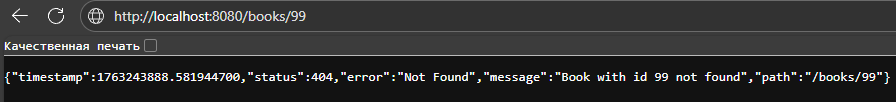
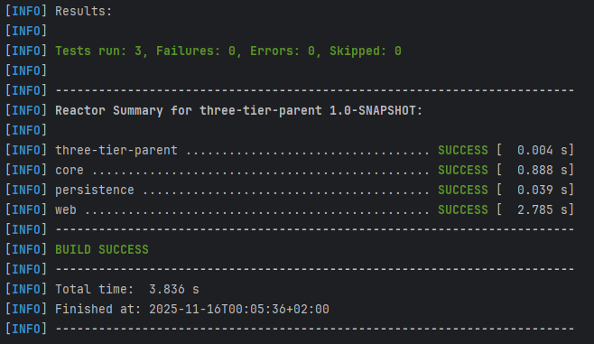

# Звіт по Лабораторній роботі 2: 3-рівнева архітектура

Цей репозиторій містить рішення для лабораторної роботи, що демонструє 3-рівневу архітектуру (Core, Persistence, Web) на базі багатомодульного Maven-проекту.

* **`core`**: Доменний шар (моделі, сервіси, бізнес-логіка).
* **`persistence`**: Шар доступу до даних (реалізація портів `core` через JDBC/H2).
* **`web`**: Шар презентації (HTTP API, Servlets, JSON).

---

## 🚀 Інформація про запуск

1.  **Збірка:** `mvn clean install` (з кореневої папки `three-tier-parent`)
2.  **Запуск:** `cd web` -> `mvn jetty:run`
3.  **URL додатка:** `http://localhost:8080/books`

---

## 📋 Теоретичні питання (Звіт)

### 1. Які переваги дає використання трирівневої архітектури у веб-застосунках?

Трирівнева архітектура (Web, Core/Domain, Persistence) надає ключові переваги:

* **Розділення відповідальності (Separation of Concerns):** Кожен шар має одну чітку мету. `Web` відповідає за HTTP та JSON, `Core` — за бізнес-правила (наприклад, "чи можна видалити коментар?"), а `Persistence` — за збереження даних (SQL).
* **Висока ремонтопридатність (Maintainability):** Якщо нам потрібно змінити базу даних (наприклад, H2 на PostgreSQL), ми змінюємо лише шар `Persistence`. `Core` і `Web` залишаються недоторканими.
* **Тестованість (Testability):** Ми можемо легко тестувати бізнес-логіку (`Core`) окремо, просто "підсунувши" їй тестові репозиторії (моки), без необхідності запускати реальну базу даних чи веб-сервер.
* **Повторне використання (Reusability):** "Мозок" (`Core`) не прив'язаний до `Web`. Ми можемо легко використовувати ту саму бізнес-логіку для мобільного додатку, десктопного клієнта чи CLI-утиліти.

### 2. Чому доменний шар (core) не повинен залежати від JDBC чи Servlet API?

Доменний шар (`Core`) — це **ядро вашого бізнесу** і він має бути "чистим" від інфраструктурних деталей:

* **Залежність від JDBC** прив'язує вашу бізнес-логіку до реляційних баз даних. Що, як ви захочете зберігати дані в іншому місці (наприклад, у файлі або NoSQL базі даних)? Використовуючи "Порти" (інтерфейси), ми інвертуємо цю залежність: `Core` *диктує* контракт, а `Persistence` його *реалізує*.
* **Залежність від Servlet API** прив'язує вашу логіку до HTTP. Ваше правило "коментар можна видалити лише протягом 24 годин" не має нічого знати про `HttpServletRequest` чи `JSON`. Воно має працювати з чистими об'єктами (ID коментаря, час). Це дозволяє повторно використовувати цю логіку в будь-якому іншому контексті.

### 3. Як ArchUnit допомагає підтримувати архітектурну дисципліну в проєкті?

ArchUnit — це **"охоронець" вашої архітектури**, який працює як автоматизований тест.

* **Автоматизує перевірку правил:** ArchUnit — це тест, який впаде під час збірки (наприклад, `mvn test`), якщо розробник помилково порушить архітектурні правила (наприклад, викличе `persistence` з `web` шару).
* **Запобігає "архітектурній ерозії":** З часом проекти стають заплутаними, з'являються "спагеті-залежності". ArchUnit фіксує початкові правила (наприклад, "Core нічого не знає про Servlets") і не дає проекту "згнити" зсередини.
* **Служить документацією:** Тести ArchUnit самі по собі є чіткою, виконуваною документацією, яка описує, як модулі мають (і не мають) взаємодіяти.

---

## 📸 Скріншоти (Звіт)

*(Тобі потрібно створити папку `screenshots` у корені проекту та покласти туди ці файли)*

### 1. Скріншот логування помилки 404
*Запит до `http://localhost:8080/books/99` показав коректну JSON-відповідь про помилку.*

### 2. Скріншот успішного виконання ArchUnit-тестів
*Команда `mvn test` (або `mvn install`) успішно виконалась, підтвердивши, що архітектурні правила не порушені.*

