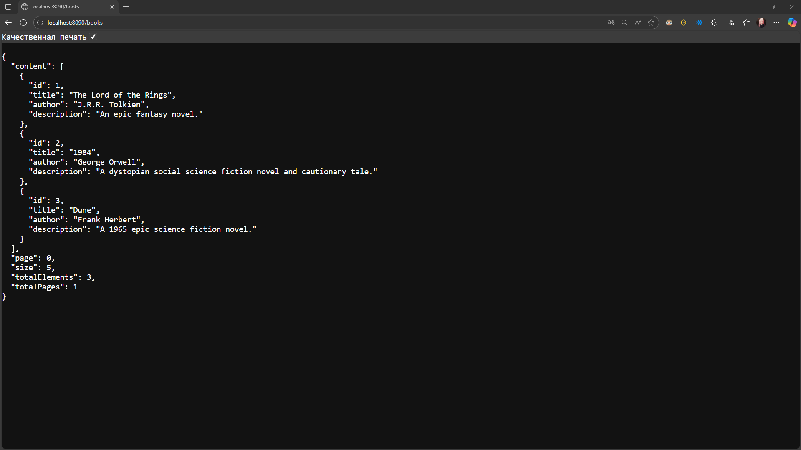
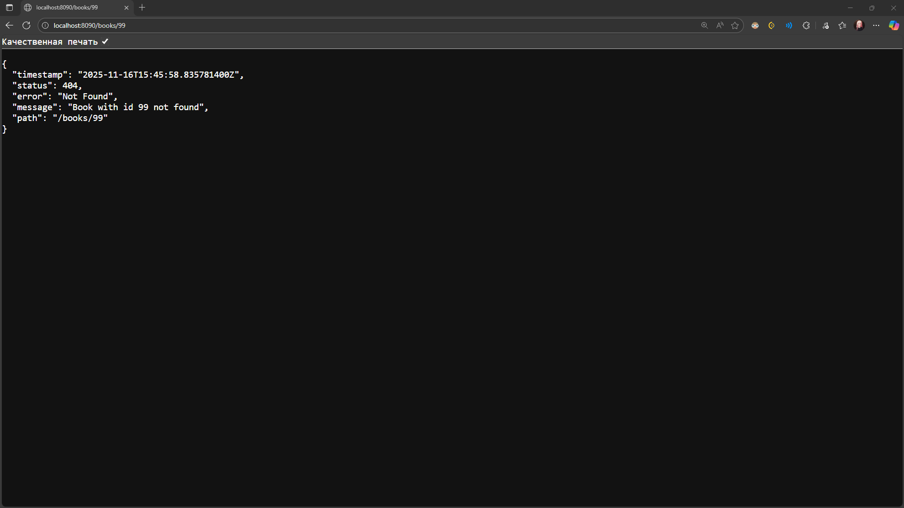
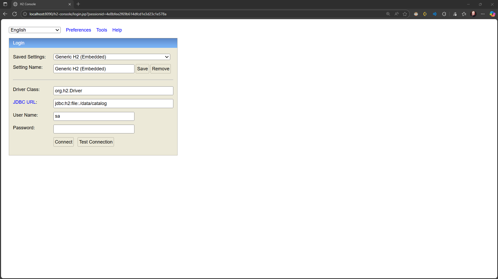
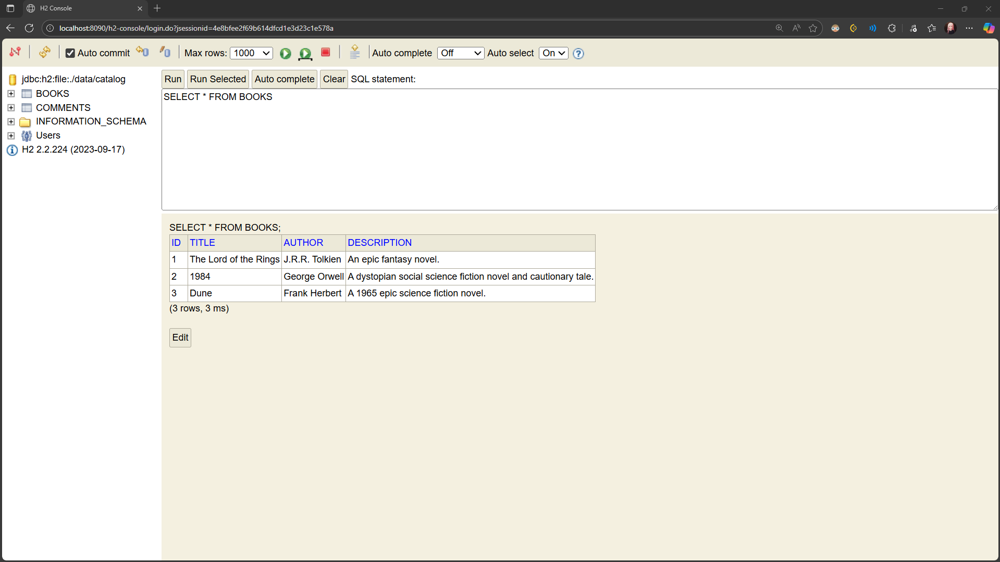

# Звіт по Лабораторній роботі 3: Spring Core & Boot

Цей репозиторій містить рішення для лабораторної роботи 3. Проект з Лабораторної 2 був успішно мігрований на **Spring Boot**.

**Основні зміни:**
* Проект переведено з `war` на `jar` з вбудованим сервером Tomcat.
* Видалено ручне керування залежностями (`AppContextListener`, `web.xml`).
* Впроваджено **IoC/DI** контейнер Spring для керування бінами.
* Сервлети замінено на сучасні `@RestController`.
* Налаштування (порт, БД) винесено у `application.properties`.

---

## 🚀 Інформація про запуск

1.  **Збірка:** `mvn clean install` (з кореневої папки `three-tier-parent`)
2.  **Запуск:**
    * Знайти клас `web/src/main/java/ua/com/lab/web/Application.java`.
    * Натиснути зелену стрілку (▶️) біля `main()` методу і вибрати "Run 'Application.main()'".
3.  **URL додатка:** `http://localhost:8090/books` (порт **8090**!)
4.  **H2 Console (бонус):** `http://localhost:8090/h2-console`
    * **JDBC URL:** `jdbc:h2:file:./data/catalog`
    * **User:** `sa`
    * **Password:** (порожній)

---

## 📋 Теоретичні питання (Звіт)

### 1. Пояснення IoC (Inversion of Control)
**Інверсія керування (IoC)** — це принцип проектування, за якого контроль над створенням об'єктів та їхніми залежностями передається зовнішньому контейнеру (у нашому випадку — Spring).

* **До (2 Лабораторної):** Наш `AppContextListener` **вручну** створював `JdbcBookRepository`, потім `BookService` і "проштовхував" один в одного. Ми самі керували процесом.
* **Після (3 Лабороторної):** Ми просто позначаємо класи анотаціями (`@Service`, `@Repository`). Ми **не** пишемо `new BookService()`. Spring-контейнер сам читає ці анотації, створює об'єкти та керує їхнім життєвим циклом. Контроль "інвертований" — тепер він у фреймворку.

### 2. Пояснення DI (Dependency Injection)
**Ін'єкція залежностей (DI)** — це *конкретна реалізація* принципу IoC. Це процес, за допомогою якого Spring-контейнер "інжектить" (inject) залежності в об'єкт.

Ми продемонстрували два типи ін'єкції:

1.  **Ін'єкція через поле (Field Injection):**
    * *Де:* `BookController` та `BookService`.
    * *Приклад:*
    ```java
    @Autowired
    private BookService bookService;
    ```
    * *Як працює:* Spring автоматично знаходить бін `BookService` у контейнері та "вставляє" його у це поле.

2.  **Ін'єкція через конструктор (Constructor Injection):**
    * *Де:* `CommentController` та `JdbcBookRepository`.
    * *Приклад:*
    ```java
    private final CommentService commentService;

    public CommentController(CommentService commentService) {
        this.commentService = commentService;
    }
    ```
    * *Як працює:* Це найкращий спосіб. Spring бачить, що конструктору потрібен `CommentService`, знаходить цей бін і передає його як параметр під час створення `CommentController`.

### 3. Пояснення автоконфігурації Spring Boot
**Автоконфігурація** — це механізм Spring Boot, який автоматично налаштовує додаток на основі наявних у classpath бібліотек (залежностей) та визначених властивостей. Головна мета — мінімізувати кількість ручного конфігурування, необхідного для запуску.

* Коли ми додали `spring-boot-starter-web`, Spring Boot побачив це і *автоматично*:
    1.  Запустив вбудований сервер **Tomcat**.
    2.  Налаштував `DispatcherServlet` (який замінив `web.xml`).
    3.  Налаштував **Jackson** (для перетворення `Book` в JSON).

* Коли ми додали `spring-boot-starter-jdbc` та `h2`, Spring Boot *автоматично*:
    1.  Зрозумів, що нам потрібна база даних.
    2.  Прочитав `application.properties`, знайшов `spring.datasource.url`.
    3.  Створив та налаштував `DataSource` (пул з'єднань Hikari) для нашої H2.
        Нам не довелось писати жодного рядка коду для налаштування Tomcat чи `DataSource` — все це зробила автоконфігурація.

---

## 📸 Скріншоти (Звіт)

### 1. Робота застосунку (Список книг)
*Запит: `http://localhost:8090/books`*



### 2. Робота застосунку (Обробка помилки 404)
*Запит: `http://localhost:8090/books/99`*



### 3. Робота H2 Console
*Запит: `http://localhost:8090/h2-console`*


