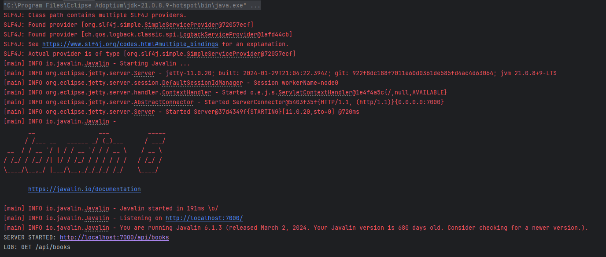
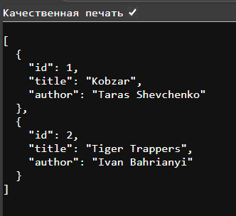
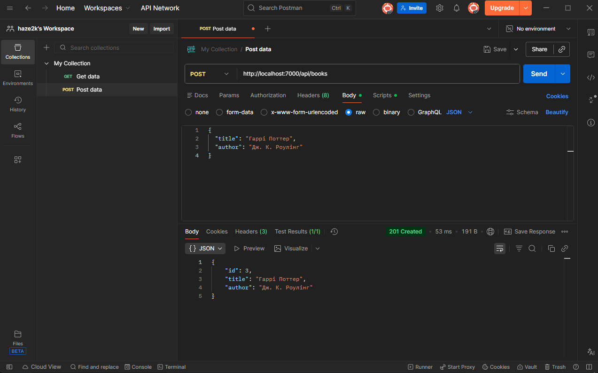
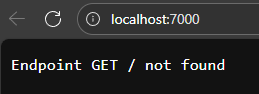

# Лабораторна робота №5: Мікрофреймворк Javalin

**Тема:** Створення REST-сервісу, middleware, порівняння зі Spring MVC.

---

## 🎯 Мета роботи
Ознайомитися з підходом мікрофреймворків на прикладі **Javalin**. Навчитися створювати базовий REST-сервіс, налаштовувати маршрути, обробляти запити та відповіді через `Context`, додавати middleware і обробники винятків. Виконати порівняння зі Spring MVC щодо конфігурації та архітектури.

---

## 🛠 Хід виконання

### 1. Підготовка середовища
Робота виконувалася в модулі `web` існуючого багатомодульного проекту.
- **Вилучено:** Залежності `spring-boot-starter-web` та всі контролери Spring MVC.
- **Додано:** Бібліотеку `Javalin 6.1.3`.
- **Вирішено конфлікт версій:** Оскільки батьківський проект використовує Spring Boot 3 (Jetty 12), а Javalin потребує Jetty 11, у `pom.xml` було примусово прописано версії бібліотек Jetty:

```xml
<dependency>
    <groupId>org.eclipse.jetty</groupId>
    <artifactId>jetty-server</artifactId>
    <version>11.0.20</version>
</dependency>
```

### 2. Реалізація REST-сервісу
Створено клас `ua.com.lab.web.JavalinBookApp`. Замість контролерів з анотаціями використано декларативний опис маршрутів.

**Ключові елементи коду:**

* **Middleware (Логування):**
    ```java
    app.before(ctx -> System.out.println("LOG: " + ctx.method() + " " + ctx.path()));
    ```

* **Exception Handling (Обробка помилок):**
    ```java
    app.exception(Exception.class, (e, ctx) -> {
        ctx.status(500).result("Server Error: " + e.getMessage());
    });
    ```

* **Маршрути (GET/POST):**
    ```java
    // Отримати всі книги
    app.get("/api/books", ctx -> ctx.json(bookDb));

    // Додати книгу
    app.post("/api/books", ctx -> {
        Book newBook = ctx.bodyAsClass(Book.class);
        bookDb.add(newBook);
        ctx.status(201).json(newBook);
    });
    ```

---

## 📸 Результати тестування

Нижче наведено скріншоти, що підтверджують працездатність сервісу.

### 1. Запуск сервера
Успішний старт Javalin на порту 7000.


### 2. Отримання списку книг (GET)
Запит до `/api/books` повертає JSON-масив.


### 3. Додавання нової книги (POST)
Успішне створення ресурсу через передачу JSON.


### 4. Обробка помилок
Приклад відповіді сервера при запиті неіснуючого ресурсу або некоректних даних.


---

## 📊 Порівняльна таблиця: Spring MVC vs Javalin

| Критерій | Spring MVC / Boot (Лаб 4) | Javalin (Лаб 5) |
| :--- | :--- | :--- |
| **Тип** | Full-stack Framework (Opinionated) | Microframework (Library-first) |
| **Конфігурація** | "Магічна" (Auto-configuration, Annotations) | Явна (все прописується кодом в `main`) |
| **Server** | Tomcat (вбудований за замовчуванням) | Jetty (вбудований) |
| **DI (Inversion of Control)** | Потужний контейнер бінів (`@Autowired`) | Відсутній (ручне створення об'єктів або сторонні ліби) |
| **Routing** | Класи-контролери (`@RestController`) | Лямбда-вирази (`app.get(...)`) |
| **Persistence** | Spring Data JPA / JDBC (автоматичний `DataSource`) | Потрібно налаштовувати вручну (використано In-Memory) |
| **Поріг входження** | Високий (треба знати життєвий цикл Spring) | Низький (зрозуміло для новачків) |

---

## 📝 Висновки

У ході лабораторної роботи було виконано міграцію веб-шару додатка зі Spring MVC на Javalin.

**Основні спостереження:**
1.  **Простота:** Javalin значно простіший у налаштуванні. Для запуску REST-сервісу знадобився лише один клас та мінімум залежностей.
2.  **Контроль:** Відсутність "магії" Spring дозволяє чітко розуміти потік виконання програми, але вимагає писати більше шаблонного коду (boilerplate) для підключення бази даних чи валідації.
3.  **Обмеження:** Головною складністю стала відсутність вбудованого механізму Dependency Injection та автоконфігурації БД, через що довелося використовувати імітацію репозиторію в пам'яті (List) замість H2 Database.

**Вердикт:** Javalin ідеально підходить для мікросервісів та швидких прототипів, тоді як Spring MVC залишається стандартом для складних корпоративних систем.