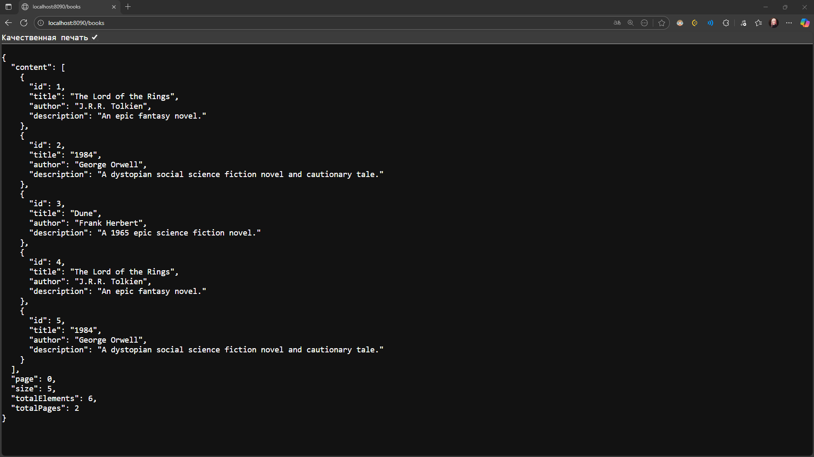
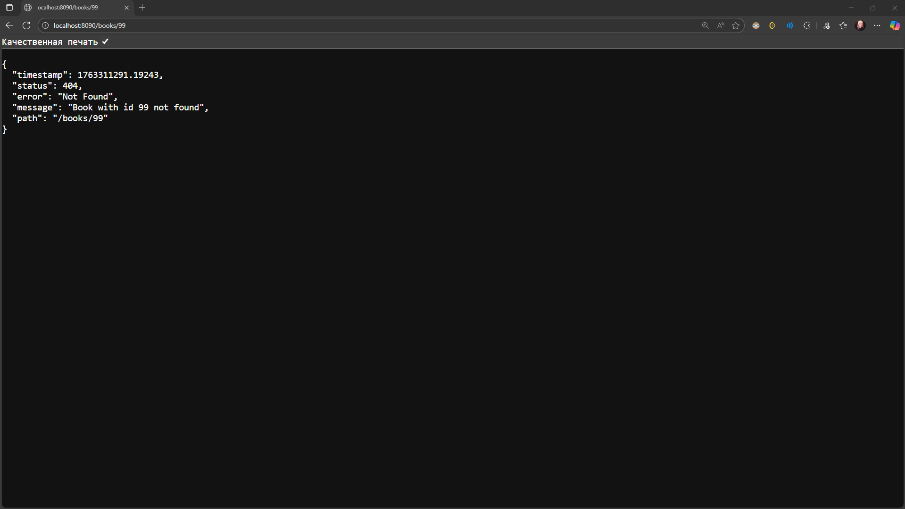
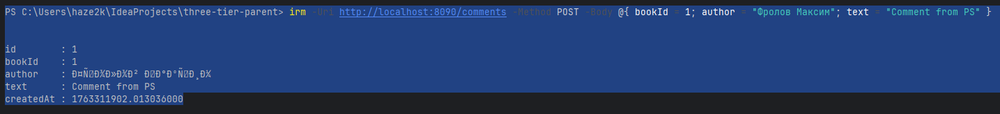
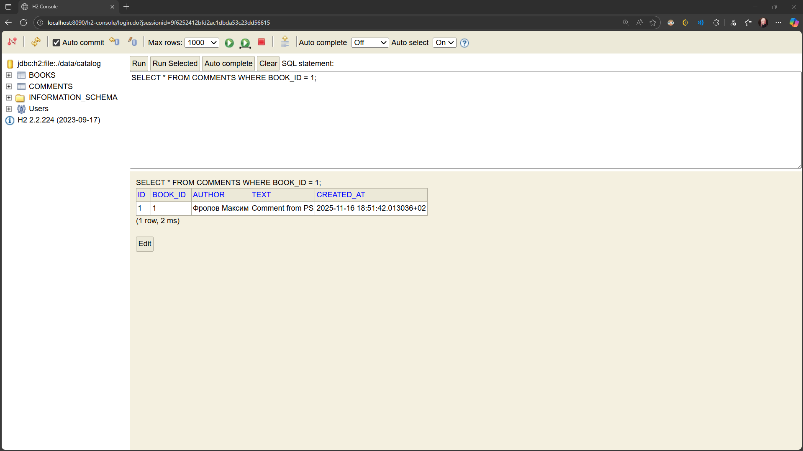

# Звіт по Лабораторній роботі 4: Фіналізація Spring MVC REST API

Цей проект є фінальною версією багатомодульного застосунку (Core/Persistence/Web), повністю мігрованого на **Spring Boot** та архітектуру **Model–View–Controller (REST)**.

**Основна мета:** Замінити сервлети на контролери (`@RestController`) та продемонструвати повний цикл маршрутизації та обробки даних у Spring MVC.

---

## 🚀 Як запустити

1.  **Зібрати проект:**
    Виконати з кореневої папки `three-tier-parent`:
    ```bash
    mvn clean install
    ```

2.  **Запустити додаток:**
    Знайти клас `web/src/main/java/ua/com/lab/web/Application.java` і запустити його `main()` метод (вбудований Tomcat).

3.  **URL додатка:** `http://localhost:8090/books`

## 🌐 API Ендпоїнти

* **GET http://localhost:8090/books**
    * Повертає список книг із пагінацією (JSON).

* **GET http://localhost:8090/books/{id}**
    * Повертає дані однієї книги.

* **POST http://localhost:8090/comments**
    * Додає новий коментар (використовуйте `form-data`).

---

## 📋 Звіт: Питання про Spring MVC

### 1. Роль DispatcherServlet, контролерів та моделей у Spring MVC

| Компонент | Роль |
| :--- | :--- |
| **`DispatcherServlet`** | **Фронт-контролер.** Єдина точка входу, що перехоплює всі запити. Відповідає за **маршрутизацію** (пошук контролера-обробника) та управління циклом запит–відповідь. |
| **Контролери (`@RestController`)** | **Обробники запитів.** Приймають вхідні HTTP-параметри, викликають методи сервісів (`core`) та повертають доменні об'єкти. |
| **Моделі (`Book`, `Comment`)** | **Об'єкти передачі даних (DTO).** Містять дані, які контролер отримує від сервісів. Серіалізуються у фінальну JSON-відповідь. |

### 2. Чим Spring MVC відрізняється від підходу на сервлетах?

1.  **Маршрутизація:** Spring MVC використовує гнучку маршрутизацію через анотації (`@GetMapping`, `@RequestMapping`), тоді як сервлети вимагають жорсткої прив'язки URL до класу в `web.xml`.
2.  **Обробка даних (Data Binding):** Spring MVC автоматично прив'язує параметри запиту (`@RequestParam`, `@PathVariable`) до аргументів методів контролера, усуваючи необхідність ручного парсингу з `request.getParameter()`.
3.  **Автоматизація:** Spring Boot бере на себе налаштування `DispatcherServlet`, Tomcat та `ObjectMapper` (JSON), що усуває необхідність у файлах `web.xml` та `AppContextListener`.

### 3. Як організовано маршрутизацію HTTP-запитів у Spring MVC?

Маршрутизація організована декларативно через анотації. `DispatcherServlet` використовує **`HandlerMapping`** для пошуку методу контролера, чий `@RequestMapping` відповідає шляху запиту. Знайдений метод викликається, а його параметри автоматично заповнюються механізмом прив'язки даних.

### 4. Як передаються дані між контролером і бізнес-логікою?

1.  **Контролер** отримує вхідні дані з HTTP-запиту.
2.  Контролер викликає метод **Сервісу** (`BookService`), який був ін'єктований Spring'ом.
3.  **Сервіс** виконує логіку і повертає **доменні об'єкти** (`Book`, `Page<Book>`) контролеру.
4.  **Контролер** повертає ці доменні об'єкти. Завдяки анотації `@RestController`, Spring та Jackson **автоматично** серіалізують їх у JSON.

### 5. Як Spring обробляє помилки та повертає статуси відповідей.

Spring використовує централізований механізм обробки через клас **`@RestControllerAdvice`** та методи **`@ExceptionHandler`**.

* Цей глобальний обробник перехоплює винятки (`NotFoundException`, `ValidationException`) з усіх контролерів.
* Обробник формує об'єкт `ResponseEntity`, явно встановлюючи необхідний HTTP-статус (наприклад, **404 Not Found**, **400 Bad Request** або **409 Conflict**) замість стандартної відповіді 500.

---

## 📸 Скріншоти

### 1. Робота застосунку (Список книг)



### 2. Робота застосунку (Обробка помилки 404)



### 3. Робота CRUD-операцій (Додавання коментаря)


